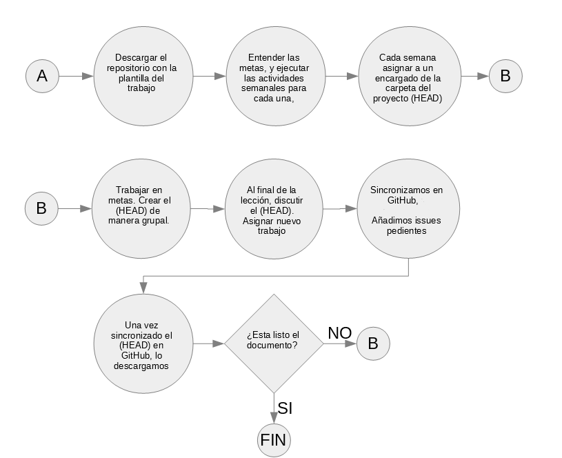

# Asignaciones

Las tareas cuentan con un valor de \SI{5}{\percent} cada una. Se califica:

- Presentación \SI{1}{\percent}.

- Planteamiento \SI{1}{\percent}.

- Explicación de la lógica del procedimiento para resolver el problema \SI{2}{\percent}.

- Respuesta acertada \SI{1}{\percent}.

## Tarea 01: Crecimiento geométrico

### Ejercicio 1 {-}

Asuma que en una población de 311 individuos, en promedio *cada año* entran 10 individuos (nacimientos e inmigración), y salen 15 individuos (muertes y emigración). Algunos estudios han determinado que si la población se reduce a menos de 50 individuos no se podrá recuperar, y se declara como una extinción local.

a.  Calcule $R_m$ de la población.

a. Calcule la tasa de multiplicación $\lambda$.

a. Asumiendo que $\lambda$ se mantiene constante, estime el tiempo que tomará a la población extinguirse localmente ($t$ corresponde a un año).

### Ejercicio 2 {-}

Se ha estimado que $\lambda = 0.7$ en una población cosechada\footnote{en este caso, la cosecha implica la muerte del individuo} de tamaño $N = \num{10e6}$ individuos. Se sabe que el potencial reproductivo anual es de un millón de nuevos individuos, y que la mortalidad natural es de seiscientos mil individuos. ¿Cuántos individuos mueren debido a la cosecha? ¿Cuántos individuos deberían ser extraídos para evitar que la población decrezca?

\newpage

## Tarea 02: 

\newpage

## Tarea 03: 
\newpage

## Tarea 04: Ejercicios con tablas de vida

### Objetivo general

Valorar la importancia de las tablas de vida, para el manejo de recursos naturales.

### Instrucciones

*Lea el problema y aplique las tablas de vida para resolver la pregunta*

Asuma que usted es parte de un grupo consultor que ha desarrollado un plan de manejo para un área que protege el ciclo reproductivo de una población de cabra de monte, como base alimenticia de grandes depredadores.

Después de un muestreo intensivo, se obtiene una distribución de frecuencias por edad para las hembras. Tras corregir las frecuencias en cada talla, se utiliza el método de tablas estacionarias basadas en la estructura de edad de la población, para construir las clases de edad y supervivientes. También se obtuvo un promedio de las crías hembra sobrevivientes en cada clase de edad por hembra.

Los datos obtenidos son los siguientes:

```{r , echo=FALSE}
M <- matrix(c(
  1:13,
  205, 96, 94, 89, 79, 68, 55, 43, 32, 22, 15, 10 ,6,
  0,0,rep(1.01,times=10),0
), ncol = 3,
byrow = FALSE)

colnames(M) <- c("x","Sx","mx")

print(M)

```


Los administradores del área protegida están de acuerdo, en que se considera que el plan de manejo es efectivo, si la población de cabras aumenta o se mantiene constante. Ellos le han solicitado que usted haga esta evaluación, y les brinde los resultados.

¿Es el plan de manejo efectivo?

### Presentación

- Presente la tarea en un archivo **R Markdown**, usando la plantilla de abajo.

- Complete las secciones del código que se solicitan.

- Corra el código y verifique que funcione, y que los resultados tienen sentido.

- De su respuesta a los administradores del área protegida.

Envíe solo el archivo `.Rmd` al profesor.


**Descargue la plantilla para la tarea** [aquí](https://github.com/dawidh15/dinPob/tree/master/plantillas_estudiantes)

\newpage

## Tarea 05: Matrices de transición

### Objetivo

Utilizar las matrices de transición para hacer una *Análisis de Viabilidad Poblacional* bajo diferentes escenarios de manejo.


```{r, include=FALSE}
rejectOdd <- 1.14
```

### Instrucciones

Resuelva el siguiente problema de gestión de recursos naturales, utilizando la teoría y práctica de matrices de transición.

### Contexto

En las islas de Lofoten, en Escandinavia, aún existe una importante tradición ballenera. Tras años de estudio y acercamientos con los balleneros, se ha decidido permitir la casa de ballenas. Existen 15 empresas y familias balleneras y cada una clama por un permiso de caza para dos ballenas al año.

La autoridad que gestiona los recursos naturales le ha encomendado analizar el efecto de extraer las 30 ballenas al año sobre los siguientes parámetros poblacionales:

- La probabilidad de alcanzar un umbral de cuasi-extinción de 80 animales **sub-adultos y adultos** a 15 años. Para investigar el efecto de la cosecha a largo plazo.

- Evidencia gráfica de las estimaciones.

Además le piden incluir estimados de incertidumbre (excepto para la probabilidad de extinción).

El criterio de rechazo de los escenarios de manejo es el siguiente:

> *La chance de la probabilidad de cuasi-extinción de obtener 80 animales sub-adultos o adultos en 15 años después de la cosecha debe ser menor a `r rejectOdd`*

Para calcular la chance se toma la razón de la probabilidad de extinción del escenario evaluado ($p_e$) más uno, por la probabilidad de extinción actual ($p_0$) más uno:

$$
o = \frac{1+p_e}{1+p_0}
$$

Los anteriores ecólogos determinaron la matriz de transición de esta población de ballenas. Para cada parámetro de la matriz han determinado una distribución de probabilidad, y han puesto a su disposición una función para generar matrices de transición estocásticas `hacerStockMatriz`. (Esta función se encuentra en el archivo `sourceT05.R`)

El último censo de población determinó la siguiente estructura poblacional.

$$
\mathbf{n}
=
\begin{pmatrix}
 n_0\\ 
 n_1\\ 
 n_2\\
 \end{pmatrix}
=
\begin{pmatrix}
 153\\ 
 81\\ 
 43\\
 \end{pmatrix}
$$

Donde $n_0$ son juveniles, $n_1$ subadultos y $n_2$ adultos.


### Instrucciones

Calcule los parámetros poblacionales solicitados distribuyendo la mortalidad de la siguiente forma:

1. Reste los treinta individuos a la clase $n_0$.

1. Reste los treinta individuos a la clase $n_1$.

1. Reste los treinta individuos a la clase $n_2$.

1. Reste los treinta individuos equitativamente a la clase $n_2$ y $n_1$.

1. Reste homogéneamente los treinta individuos en todas las clases.

Utilice la clase de referencia `transStochMat` (Esta función se encuentra en el archivo `sourceT05.R`). **Ver material del curso para obtener instrucciones de su uso, Matrices de Transición**.

\newpage

## Tarea 06

### Contexto

A lo largo del curso se han desarrollado conceptos que dependen del entendimiento de la abundancia de una población. El propio concepto de abundancia es complejo, y aunado a esta complejidad, la abundancia observada y real depende de factores importantes como: la probabilidad de detección, la probabilidad de ocurrencia, la capturabilidad.

### Objetivo

Estimular la comprensión de estos conceptos claves para la estimación de la abundancia, a través de la investigación de los mismos.

### Instrucciones

- Utilice formato APA para la bibliografía.

- Utilice al menos 6 fuentes bibliográficas.

- Presente el documento como **PDF editable**, a más tardar el 16 de junio de 2018. No se reciben ni califican trabajos entregados posteriormente a esta fecha.

### Desgloce de calificación

- El concepto descrito es el apropiado. De lo contrario, la pregunta se invalida.

- La explicación del concepto y su elaboración a través de ejemplos, no contiene ambigüedades, y se expresa de manera lógica y correcta (puede ser falsificable, es decir, sujeto de predicciones y pruebas). De lo contrario la pregunta se invalida.

- Ortografía. Por cada falta de ortografía se resta medio punto (0.5 pts).

- El ejemplo es pertinente, es decir, pertenece al concepto que se explica, y aporta elementos importantes para la comprensión del concepto. Se resta medio punto por cada ejemplo inapropiado.

- Bibliografía. Se incluyen al menos 6 referencias bibliográficas. Se restan 2 puntos de lo contrario.

- Originalidad. Si se detecta y demuestra plagio, de cualquier tipo, se invalida la tarea y se pasa nota a la dirección de la ECB.

- La tarea vale cinco puntos (5 pts).

### Recomendaciones:

Tenga a mano un libro de teoría de conjuntos y probabilidad para enteder mejor, y explicar mejor los conceptos.

### Responda las siguientes preguntas:

1. ¿Qué es la probabilidad de detección? Desarrolle dos ejemplos.

1. ¿Qué es la probabilidad de ocurrencia? Desarrolle dos ejemplos.

1. ¿Qué es la capturabilidad? Desarrolle dos ejemplos.

1. ¿Cómo afecta la estimación de la abundancia cada uno de estos conceptos? 

1. Exprese en una relación matemática los siguientes casos. Utilice solo los conceptos de probabilidad de detección y ocurrencia:

    1. ¿cuál es la probabilidad de obtener un conteo de cero indivduos en un sitio de muestreo, dado que sí existían individuos en dicha área?
    
    1. ¿Cuál es la probabilidad de obtener un conteo con cero individuos, si no estamos seguros de que existan individuos en el sitio?
    
        1. ¿Cuál es la probabilidad de obtener un conteo con más de un individuo?
    
Para resolver la pregunta anterior, utilice los siguientes símbolos:

$\mathrm{Pr}(y)$ Probabilidad de observar $y$ individuos.

$\Psi$: Probabilidad de ocurrencia.

Tip. Busque en internet los fundamentos de las distribuciones de probabilidad infladas por cero. Por ejemplo, *Zero inflated Poisson*, *Zero inflated negative-binomial*. Etc.

\newpage

## Trabajo individual

### Objetivo general

Valorar la importancia de la estructura de trabajo del curso; al exponer al estudiante a las múltiples aplicaciones que se desarrollan en la plataforma de trabajo que se ha adoptado durante el semestre.

### Instrucciones

El estudiante buscará un paquete en \textsf{R} relacionado con el tema de ecología de poblaciones o similar. No se permite el paquete **popbio**; porque ya se está utilizando en el curso.

Una vez seleccionado el paquete, el estudiante elaborará un documento **R Markdown**, con las siguientes secciones:

1. Introducción: ¿Qué hace el paquete? *Máximo 3 párrafos*.

1. Desarrolladores: ¿Quién o quienes desarrollaron el paquete, y qué experiencia tienen? *Máximo 3 párrafos*

1. Hacer un ejemplo con las funciones y datos del paquete. *Máximo 2 hojas por ambos lados*.

La mayoría de paquetes vienen con datos de prueba y tutoriales. El estudiante puede escoger una de las características principales del paquete y desarrollarla en el documento.

La idea es utilizar "*chunks*" para demostrar el uso del paquete a los compañeros.

### Exposición

El estudiante hará una breve exposición sobre sus resultados, a partir del 28 de mayo. La exposición tendrá una duración máxima de diez minutos. El estudiante puede hacer una presentación tradicional, o una sesión en vivo del uso del paquete.


### Sugerencias

- rMark

- Rcapture

- rDistance

- vegan

Existen muchos paquetes relacionados con el Ambiente y la Ecología en la página de [CRAN Taks View](https://cran.r-project.org/web/views/Environmetrics.html)

\newpage

## Trabajo grupal

### Objetivo general

Aplicar los conocimientos del curso en una simulación de un proyecto colaborativo, utilizando las herramientas de trabajo vistas en el curso (\textsf{R}, **R Markdown**, **Git** y **GitHub**), para que el estudiante se familiarice con las nuevas tendencias de *Open Science*.

### Objetivos específicos

1. Sintetizar el aprendizaje en un informe científico de la investigación, usando las herramientas de trabajo vistas en clase.

1. Valorar la importancia la justificación del procedimiento de análisis para escoger el método de toma de datos.

1. Aplicar los conocimientos teóricos del curso mediante una proyección sobre la probabilidad de extinción local de las poblaciones que vamos a muestrear.

1. Entender la importancia de verificar si nuestros resultados cumplen las suposiciones de nuestro procedimiento de análisis en la discusión del informe.

### Justificación

La ciencia tiene principios fundamentales muy estrictos. Uno de ellos es la repetibilidad y/o reproducibilidad de los hechos con los cuales se fundamentan las hipótesis o las teorías. Los trabajos en ecología presentan problemas de repetibilidad y reproducibilidad *en el campo*, pero de hecho, sí podemos corroborar los resultados y el cumplimiento de supuestos de los análisis de otras personas. Incluso, podemos mejorar el trabajo de otros en colaboración, siempre y cuando, tengamos acceso a cierta información de estos estudios.

Muchos investigadores e instituciones, como editoriales científicas, entienden que para la ciencia es necesario un mejor flujo de información [@dataManagmentBES; @reprodCodeBES]. El éxito de algunas iniciativas de colaboración y *Open Science*, radica en este principio. Por ejemplo, los investigadores que desarrollan análisis bioestadísticos se han beneficiado de divulgar sus procedimientos al público; ya que, investigadores similares colaboran con ellos y constantemente mejoran los análisis, corrigen errores, o sugieren nuevas alternativas o métodos. Y esto solo ha ocasionado el beneficio de los numerosos usuarios de sus paquetes, y de la calidad de los análisis y por ende, las decisiones basadas en resultados.

Es importante que los estudiantes de esta licenciatura conozcan estas nuevas tendencias, y las herramientas que las han hecho posibles. Por ello, montaremos una simulación de un trabajo colaborativo en el campo de la Ecología de Poblaciones Silvestres.

### Definiciones

**mortalidad**: Se refiere a la cantidad de individuos que mueren de una clase de edad o talla a la siguiente.

**supervivencia**: Es lo opuesto a la *mortalidad*. Es la cantidad de individuos que sobrevive de una talla a la siguiente.

**fecundidad**: La cantidad de huevos que produce cada individuo de *Siphonaria* spp. o de *Strombus* spp.

**Matrices de transición**: Es una matriz que contiene elementos de mortalidad o supervivencia y fecundidad, Se utiliza para hacer proyecciones del tamaño de una población.

**fecha de cumplimiento**: Es la fecha en la que una meta *ya debe haberse concretado*.

**HEAD**. Es un término de **Git** que se refiere a la versión más reciente de un documento que usa control de versión.


### Metas

**Meta 1, (7%). Fecha de cumplimiento 19 de abril**: Generar una revisión bibliográfica sobre temas relacionados con la ecología poblacional de *Siphonaria gigas* (o similares), y de *Strombus galeatus* (o *S. gigas*). Los estudios incluidos deben contener información sobre:

- Crecimiento: talla de los animales en relación al tiempo.

- Mortalidad: estimaciones numéricas o datos de mortalidad

- Supervivencia: estimaciones numéricas o datos de supervivencia

- Matrices de transición: todo lo relacionado con este tema.

- Análisis de viabilidad de poblaciones: todo lo relacionado con este tema.

Durante la revisión bibliográfica es importante utilizar estos puntos como criterios de aceptación para un artículo. Si no contiene información sobre estos criterios, entonces no vale la pena incluirlo en la revisión.

Si el estudiante no está familiarizado con las herramientas de búsqueda bibliográfica y bases de datos suscritas por la Universidad Nacional, es su responsabilidad informarse con la bibliotecaria de la Unidad Académica.

**Meta 2,  (7%). Fecha de cumplimiento 3 de mayo**: Definir el procedimiento de análisis. Se basarán en la teoría, en las investigaciones individuales, y en una búsqueda general en línea, para escoger un procedimiento de análisis que permita **calcular la probabilidad de extinción de las poblaciones de interés a cinco años**.

**Meta 3,  (5%).  Fecha de cumplimiento 10 de mayo**: Diseño de muestreo. Solo hay tiempo para un sitio por población. Por tanto, el diseño de muestreo se refiere al establecimiento de las variables que se deben medir en el campo, a los formularios de campo, al procedimiento para tomar los datos y al diseño de la base de datos (se *recomienda* una base de **LibreOffice Base**).

**Meta 4,  (3%). Fecha de cumplimiento 24 de mayo**: Almacenamiento y control de calidad de datos. Esto se hará durante la gira, y la semana que sigue. Se debe comparar los formularios con los datos digitales en búsqueda de errores.


**Meta 5,  (3%). Fecha de cumplimiento 31 de mayo**: Análisis de datos. Utilizar el procedimiento de análisis y aplicarlo a los datos de campo. Idealmente, el análisis ya debería estar montado y probado en el documento principal. Por tanto, solo habría que reemplazar los datos de prueba con los reales.

**Meta 6. Fecha de cumplimiento 14 de junio**: Entrega del informe final. La discusión implica comparar los datos de entrada con los requisitos y supuestos del modelo, para analizar si la salida del procedimiento de análisis es válida o no. Esa fecha el informe *debe* ser entregado, para que el profesor lo revise. No se aceptan prórrogas. **El informe debe ser entregado, para hacer efectivo el porcentaje obtenido en cada una de las metas anteriores en la nota final**. Es decir, si el informe final no se entrega en esa fecha, se pierde todo el 25% del valor.

### Flujo semanal de trabajo

```{r echo=FALSE, fig.height=7, fig.width=7.5}

```


Para mantener el orden en el progreso del trabajo, se sugiere la siguiente metodología:

Primero, cada estudiante debe empezar por recopilar información sobre los géneros y especies mencionadas. Deben aplicar la lista de criterios para ver si la información es útil o no. El estudiante debería crear un archivo **R Markdown** con anotaciones sobre la información relevante del documento, e incorporar la información bibliográfica de cada documento revisado a un archivo `.bib`.

Luego, para iniciar la elaboración del informe grupal, el profesor debe haberles enseñado el uso de **Git**, y **GitHub**. En clase se explicará como crear y sincronizar una carpeta de trabajo en colaboración. El profesor será el "*editor*" del trabajo, es decir, él manejará la carpeta maestra, y cada estudiante es un colaborador.

Cada semana, los estudiantes asignarán a una persona encargada de manejar el *HEAD* (es decir, la versión más reciente del documento). Después de la sesión teórica, se discutirán las incorporaciones y cambios del *HEAD* con respecto a la versión del *editor*. Si se aprueban los cambios en esa sesión, el estudiante enviará una propuesta de cambios al editor ( en lenguaje de **Git**, esta propuesta se conoce como un *Pull Request*). El editor acepta la propuesta, y la sube al documento maestro. Posteriormente, todos los estudiantes se sincronizan con el documento maestro.

Si el editor no acepta los cambios, siempre aceptará el *HEAD* en el documento maestro, pero añadirá una serie de tareas y correcciones que los estudiantes deberán incorporar durante la semana.

Estos pasos se repiten semanalmente, hasta finalizar el documento.

