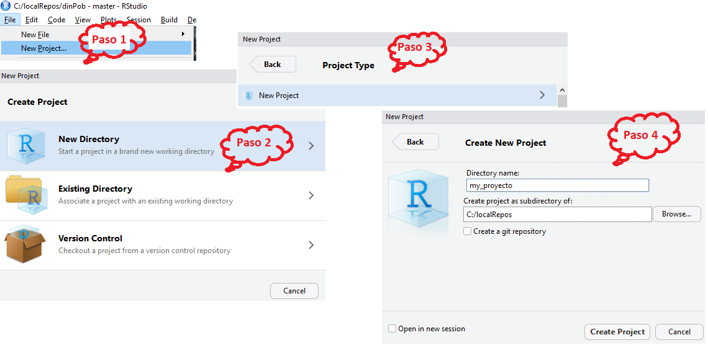

# Tutorial de R con RStudio

## Crear un proyecto en *RStudio* {#RStudioProject}

Crear un proyecto en **RStudio** para cualquier proyecto con **R**, es importante. Los proyectos organizan los documentos en una sola carpeta, y son fundamentales para el control de versión con un software como **Git**.  

Abrimos **RStudio**, y ubicamos la barra de herramientas en la parte superior. El primer paso es ir a `file --> New Project`. Creamos una carpeta en una ubicación que nos permita tener derechos de administrador, e idealmente, fuera de cualquier carpeta de sincronización en línea\footnote{En caso de que quieran tener un respaldo en la nube, se recomienda pausar la sincronización mientras se trabaja en el proyecto}.

RStudio nos guiará por los siguientes pasos:

- `Crear un Proyecto`: Escogemos que sea un nuevo directorio.

- `Tipo de Proyecto`: Escogemos *nuevo proyecto*.

- `Crear`: Escogemos la carpeta, y el nombre del proyecto. **NO** marcamos *crear repositorio con Git*.


```{r RStudioNewProject, echo=FALSE, fig.cap='Cómo hacer un nuevo proyecto, en \\textbf{RStudio}.', fig.align='center', fig.pos='thb!', cache=TRUE, dpi=200,warning=FALSE,out.width='95%',warning=FALSE}



```

Volvemos a la barra de herramientas, en **RStudio**, y vamos a `File --> New file --> R script`. Este archivo solo soporta código en **R**, con la gran ventaja de que colorea las funciones, variables y estructuras más comunes; lo cual, hace que el código sea más legible.


**IMPORTANTE**: En el siguiente tutorial, el código en **R** se encuentra dentro de ambientes especiales, rodeados por una caja gris. Escribe las líneas que se muestran en esa caja, y para ver el resultado en la consola de **R**, apreta `Ctrl + ENTER`.


## Funciones básicas en R

Ahora que hemos creado un proyecto, y tenemos un lienzo en blanco, empezamos por ver las funciones más elementales. **R** contiene todas las operaciones básicas como: adición, substracción, multipliación, división, potencias, y logaritmos.

```{r c1, eval=FALSE}

# Tras cada línea presiona Ctrl + ENTER

1 + 1 # adición

1-1 # substracción

1*2 # multiplicación

1/2 # división

2^(8) #potencia

log(2) # logaritmo natural

log10(2) #logaritmo base 10

log(x = 2, base = <n>) #logaritmo base <n>, donde <n> se
                       #   reemplaza por cualquier número.

```


Notar que en el código, cualquier línea de texto precedida de `#` es un comentario, que no será evaluado por el computador. Agregar comentarios es muy útil, si uno va a re-utilizar parte del código en otro momento. Ayuda a mantener la claridad en lo que se está haciendo.

Continuando con las operaciones básicas, también podemos mezclar operaciones de la forma que convenga. Siempre considerando las reglas de prioridad por paréntesis. Por ejemplo, si queremos calcular el logaritmo del resultado de una función, para una base 16.

```{r c2, eval=FALSE}

log( x= 1 / (1 + (5/2) ) , base = 16 )

```

Luego, como la mayoría de lenguajes de programación, podemos asignar valores a un objeto y utilizarlo después en otra operación:

```{r c3, eval=FALSE}

a <- log10(4/3)  # 'a' tiene el valor de la operación

b <- a^2 # Equivale a log10(4/3)^2

c <- b^2 - a

c
```

Esto quiere decir que podemos crear un objeto con el operador ` <- `, que pueden ser datos, o resultados de otras operaciones, para incluirlo en una nueva función. Por lo que la salida de una función puede ser la entrada de la próxima.

```{r RFunctionFlow, echo=FALSE, fig.cap='Flujo de entradas y salidas en una función de \\textbf{R}', fig.align='center', fig.pos='thb!', cache=TRUE, dpi=200,warning=FALSE,out.width='40%',warning=FALSE}

knitr::include_graphics("figuras/RFunctionsFlow.png")
```


## Estructuras de datos

**R** puede manejar objetos muy complejos; sin embargo, estos objetos generalmente se componen de partes muy sencillas. Revisaremos éstas partes sencillas, y luego crearemos un objeto más complejo.

**Vectores**

Un vector en programación, es una colección de uno o más valores. Podemos pensar que un vector en **R** equivale a una matriz de $n$ filas, y solo una columna.

```{r c4, eval=FALSE}

vect1 <- c(1,2,3,4,5,6,7,8,9,0) #es una concatenación de
# números, que se crea con la función 'c(...)'

vect2 <- rnorm(10) # son diez números al azar obtenidas
# de una distribución normal estándar

```

Los elementos de un vector pueden ser llamados utilizando un sub-índice. Éste inicia en 1, hasta $n$. Donde $n$ es la cantidad de elementos en un vector.

```{r c5, eval=FALSE}

vect1[3]


```

 También es posible llamar varios elementos a la vez, si el subíndice del vector es otro vector.
 
```{r c5b, eval=FALSE}

vect1[c(3,4,5)]

vect1[3:5] 
# 3:5 crea una secuencia de enteros, que incrementa en 1 a la vez.

vect1[rep(5,times=10)] # rep, es una función que repite un
#número un determinado número de veces.
```

Los vectores pueden ser datos en un archivo externo, o resultado de funciones u operaciones. A diferencia de otros lenguajes **R**, maneja vectores de una forma más intuitiva. 

```{r c6, eval=FALSE}

vec3 <- vec1 + vec2 # es un nuevo vector basado en la adición de los dos primeros.
```


**Matrices**

Las matrices son un arreglo de datos en dos dimensiones, es decir, filas y columnas. Por covención, cuando decimos que una matriz es de tamaño $f\times c$, nos referimos a que tiene $f$ filas, y $c$ columnas. Las filas siempre se nombran primero que las columnas.

```{r mat1, eval=FALSE}

(m1 <- matrix(1:9, ncol=3, byrow = T) )

(m2 <- matrix(1:9, ncol=3, byrow = F) )

```


Los elementos de una matriz se llaman por la combinación de filas y columnas a la que corresponde. Del ejemplo anterior, si quisiéramos obtener el elemento central de la matriz `m1`, lo llamamos así `m1[2,2]`.

Si quisiéramos llamar toda la primer columna, entonces escribimos `m1[,1]`. O la primer y tercer fila `m1[c(1,3),]`. 

Las operaciones con matrices suelen ser más delicadas y existen operadores específicos para ellas.

**Marco de datos** o *Data frames*

Esta estructura es similar a una matriz, con la diferencia, que algunas de sus columnas pueden contener *factores*, y no solo valores numéricos. Estas son las estructuras con las que representamos un diseño experimental, por ejemplo:

```{r include=FALSE}
A <- gl(2,k = 1,labels = c('T1','T2'))
B <- gl(3,k = 1, labels = letters[1:3])
D <- expand.grid(A,B)
data <- rnorm(nrow(D))
D$z <- data
```

```{r echo=FALSE}
D
rm(list = ls())
```

**Arreglos** o *arrays*

Estos son matrices de 3 o más dimensiones. Por ejemplo, si tenemos una serie de fotografías con la misma resolución, en el mismo lugar, podemos representar los pixeles como una matriz $f\times c$, y el tiempo como una dimensión adicional. Si ponemos en rápida sucesión las matrices, tendremos un video o película.

```{r ar1, eval=FALSE}
array(1:(6*2),dim=(c(2,3,2)))
```

**Listas**

Las listas son colecciones de cualquiera de los objetos anteriores (y otros que no hemos visto).

```{r eval=FALSE}
l1 <- list(
  vector = vect1,
  matriz = m1
  
)
```

Podemos llamar a los elementos de una lista, de dos formas: si conocemos el orden de los elementos de la lista, entonces, escribimos el índice dentro de dos pares de corchetes rectos: `l1[[1]]`, para llamar el vector y `l1[[2]]`, para llamar la matriz. Si conocemos los nombres de los elementos de la lista, usamos la siguiente forma: `l1$vector`, para el vector; y `l1$matriz`, para la matriz.

Una vez dentro del objeto de la lista, podemos llamar sus elementos de manera tradicional. Por ejemplo, `l1$matriz[2,2]`, para llamar el elemento central de la matriz *dentro de la lista*.

## Funciones

Las funciones se representan por un nombre, seguido de un paréntesis redondo. Todo lo que esté dentro de ese paréntesis son sus argumentos. Para finalizar la función, cerramos con un paréntesis redondo derecho:

```{r , eval=FALSE}

funcion(argumento1 = valor1,  argumento2 = valor 2)

```

Nosotros podemos crear nuestras propias funciones en R. El procedimiento es sencillo:

1. Llamamos a la función con un nombre, y declaramos que se trata de una función

1. Nombramos los argumentos de la función. Podemos asignar valores por defecto. Los argumentos deben ir entre paréntesis redondos.

1. Escribimos el cuerpo de la función entre paréntesis tipo llave `{}`. El cuerpo de la función debe terminar con *un solo* objeto que será retornado como salida del proceso.

Por ejemplo, si queremos hacer nuestra propia función para calcular un promedio. Primero debemos entender la fórmula subyacente:

$$
\bar{x}= \frac{1}{n} \sum_{i=1}^{n} X_i
$$

Es decir, sumamos todos los elementos de un vector de valores, y lo dividimos por el *tamaño*\footnote{El tamaño del vector, se refiere al total de elementos que lo conforman} del vector. Entonces, nuestro argumento será un vector, y nuestra salida, un valor único con el promedio.

```{r }

promedio <- function(vectorX){
 
   sumaX <- sum(vectorX)
   
  n <- length(vectorX) #length(), es una función que calcula 
                       #   el tamaño del vector.
  valor <- sumaX / n 
  
  return(valor)
  
}

# Ahora probamos la función, tomando el promedio de un 
#       vector de números normales con media igual a cero
#       Esperamos, que nuestro promedio sea un valor cercano
#         a cero.

valores <- rnorm(100)

(promedio(valores))

```


```{r message=FALSE, warning=FALSE, include=FALSE}
rm(list = ls())
```

## ¡Hola mundo con *Rmarkdown*!

**Objetivo**: Verificar que el estudiante ha instalado, y maneja el ambiente de trabajo que se utilizará durante el curso.

Primero revisa los enlaces provistos en el  [wiki](https://github.com/dawidh15/dinPob/wiki/02-Instalaci%C3%B3n-del-software-necesario#prueba-con-rmarkdown).

**Actividades**

-  Haz un nuevo proyecto en **RStudio**, que se llame *PracticaRmd*. Ver pasos en sección \@ref(RStudioProject).

- En la consola de **R**, escribe `install.packages(rmarkdown)`, con todas las dependencias. O instala el paquete desde **RStudio** como se mostró en el [wiki](https://github.com/dawidh15/dinPob/wiki/02-Instalación-del-software-necesario).

-  En **RStudio** `File--> New File --> R Markdown`.

-  Crea una sección principal que se llame *Información profesional*.

-  Luego, crea una sección secundaria que se llame *Intereses*. Usa bullets para nombrar algunos intereses profesionales.

-  Luego, crea una sección secundaria llamada *Experiencia Laboral*, si aplica. Nombra algunos trabajos relacionados con el curso de Ecología de Poblaciones.

-  Crea una sección principal que se llame *Integración con R*

- Consigue algunos datos interesantes en Internet. Deben ser datos para graficar, por tanto deben tener dos columnas, y varias filas. Puedes ir a [Wolfram Alpha](https://www.wolframalpha.com/). Guarda los datos como un texto delimitado por comas (`.csv`).

-  En **R** o **RStudio** corre el comando `?read.table`. Para correr un comando en **RStudio** presiona `Cntrl + R`.

-  Crea un "*chunk*" de código. Esto se hace en **RStudio**, busca un botón en la barra especial de *rmarkdown* que diga `insert`, luego escoge `R`.

-  Lee la tabla y asígnala a un objeto:

```{r , eval=FALSE}
datos <- read.table(<ruta_de_archivo_en_comillas>,
                    header = TRUE,
                    sep = ",")
```


-  Grafica los datos en un nuevo "*chunk*". Usa el método que prefieras. Hay mucho material de cómo hacer gráficos en R. Por ahora, un gráfico básico es suficiente.

- Ahora, haz otra sección llamada *Bibliografía*. En un párrafo escribe una mini-revisión de algún tema que domines y del que dispongas referencias bibliográficas. Usa los mecanismos de citas de *rmarkdown*

    - Cita en texto con `@citationKey`
    
    - Cita en paréntesis con `[@citationKey]`
    
***

**Importante**: Para que las citas funcionen, debes agregar unas opciones en la *cabecera* del documento (*YAML header*):

```
bibliography: <tu_archivo_bib>.bib
csl: apa.csl
```

El archivo `apa.csl` se puede encontrar en google. Es un archivo de estilo APA, para dar formato a la bibliografía. Revisa [el repositorio de CSL de Zotero](https://www.zotero.org/styles), en busca de las revistas disponibles.

***

-  Por último, corre el documento con el botón `knit`. Envía el documento `.Rmd` y el `.pdf` al profesor (`dawidh15@gmail.com`).

## Hacer un Pull-Request en GitHub

### Objetivo general

Aprender la mecánica de las herramientas modernas de colaboración científica.

### Instrucciones

Los pasos detallados para completar esta tarea se encuentran en el [Tutorial de Git y GitHub](https://github.com/dawidh15/dinPob/wiki/03-Tutorial-de-Git-y-GitHub), y en la [Guía para hacer un Pull Request](https://github.com/dawidh15/dinPob/wiki/04-Guía-para-hacer-un-Pull-Request).

1. Haz un *Fork* del repositorio [grupal2018](https://github.com/dinPobClase/grupal2018).

1. Crea un nuevo proyecto en **RStudio**, usando control de versión.

1. Crea una nueva rama en **Git**, que se llame `ra1`.

1. Añade tu nombre en la sección correspondiente del archivo `informe.Rmd`.

1. Haz un commit que diga *nombre añadido <su nombre aquí>*.

1. Haz un *Push* del archivo a tu repositorio.

1. Ve a **GitHub** y crea un nuevo *Pull Request*.

### **Problemas**

Es posible que **Git** no te deje subir tus cambios, o hacer un *Pull Request*. Si ves un mensaje de error que diga que estás atrás con los cambios de la rama principal, y que primero debes hacer un *Pull*, significa que otro estudiante mandó sus cambios primero, y que éstos fueron incorporados por el profesor.

Entonces debes actualizarte con la última versión del `informe.Rmd`, siguiendo [estos pasos](https://github.com/dawidh15/dinPob/wiki/04-Guía-para-hacer-un-Pull-Request#haz-un-pull-request).
